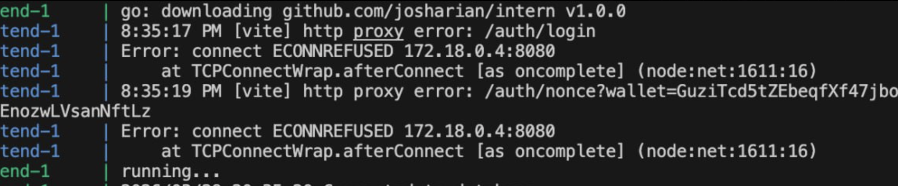

# DecentraRent — Frontend Architecture & First Module Design

## Context

DecentraRent is a Solana dApp for asset renting where loaners deposit funds and landlords provide assets. The platform needs a web frontend supporting wallet-based authentication and real-time chat. This spec covers the foundational architecture and the first module: wallet login + property-scoped chat via Centrifugo.

The Go backend is built from the start (no mock) to avoid throwaway code. The entire stack runs in Docker.

## Tech Stack

- **Frontend:** Vite, React 18, TypeScript, Zustand, TailwindCSS
- **Backend:** Go (net/http or Chi), golang-jwt, solana-go
- **Chat:** Centrifugo v5 with Go backend as proxy
- **Database:** PostgreSQL 16
- **Dev tooling:** Docker Compose, Air (Go hot reload)
- **Wallet:** @solana/wallet-adapter (Phantom, Solflare, Backpack, etc.)

## Monorepo Layout

```
DecentraRent/
├── docker-compose.yml
├── docker-compose.dev.yml
├── frontend/
│   ├── Dockerfile
│   ├── index.html
│   ├── vite.config.ts
│   ├── tailwind.config.ts
│   ├── tsconfig.json
│   ├── package.json
│   └── src/
│       ├── main.tsx
│       ├── App.tsx
│       ├── components/
│       │   ├── Layout/
│       │   └── ui/
│       ├── features/
│       │   ├── auth/
│       │   │   ├── components/       # ConnectWallet button
│       │   │   ├── hooks/            # useAuth, useWalletAuth
│       │   │   ├── store.ts          # Auth state (Zustand)
│       │   │   └── types.ts
│       │   └── chat/
│       │       ├── components/
│       │       │   ├── ConversationList.tsx
│       │       │   ├── ChatWindow.tsx
│       │       │   ├── MessageList.tsx
│       │       │   ├── MessageInput.tsx
│       │       │   └── ChatBadge.tsx
│       │       ├── hooks/
│       │       │   ├── useChat.ts
│       │       │   ├── useConversations.ts
│       │       │   └── useCentrifugo.ts
│       │       ├── store.ts
│       │       └── types.ts
│       ├── hooks/
│       ├── lib/                      # API client, Centrifugo client
│       ├── stores/
│       └── types/
├── backend/
│   ├── Dockerfile
│   ├── go.mod
│   ├── go.sum
│   ├── cmd/
│   │   └── server/
│   │       └── main.go
│   └── internal/
│       ├── auth/
│       │   ├── handler.go            # GET /auth/nonce, POST /auth/verify, POST /auth/refresh
│       │   ├── service.go            # Ed25519 verification, JWT issuing
│       │   └── middleware.go         # JWT auth middleware
│       ├── user/
│       │   ├── handler.go
│       │   ├── service.go
│       │   ├── model.go              # wallet_address, display_name, created_at
│       │   └── store.go
│       ├── chat/
│       │   ├── centrifugo_hooks.go   # Connect/subscribe/publish verification handlers
│       │   ├── handler.go            # REST: GET /conversations, GET /conversations/:id/messages
│       │   ├── service.go            # Channel permissions, message persistence
│       │   ├── model.go              # Conversation, Message models
│       │   └── store.go
│       └── config/
│           └── config.go             # Env-based configuration
├── centrifugo/
│   └── config.json
└── programs/                         # Future: Solana on-chain programs
```

## Auth Flow

### Wallet Authentication (Sign-In with Solana)

1. User connects wallet via `@solana/wallet-adapter` (Phantom, Solflare, etc.)
2. Frontend calls `GET /auth/nonce?wallet=<address>` — backend generates a random single-use nonce (5 min TTL)
3. Frontend prompts wallet to sign the nonce message
4. Frontend calls `POST /auth/verify` with `{ wallet, signature, nonce }`
5. Backend verifies Ed25519 signature against the wallet's public key
6. Backend upserts user (creates if first login) and returns JWT
7. JWT stored in Zustand (memory only, not localStorage)

### Nonce Storage

Nonces are stored in an in-memory map with TTL (5 min) on the Go backend. No database needed — nonces are ephemeral and single-use. If the backend restarts, users simply request a new nonce.

### JWT Details

- **Payload:** user_id, wallet_address, exp
- **Expiry:** 24 hours
- **Refresh:** `POST /auth/refresh` with valid JWT before expiry — returns new JWT without wallet re-sign

### Centrifugo Authentication

- Frontend connects to Centrifugo WebSocket with the JWT as connection token
- Centrifugo calls `POST http://backend:8080/centrifugo/connect` (connect proxy) — backend validates JWT, returns user info
- On channel subscribe, Centrifugo calls `POST http://backend:8080/centrifugo/subscribe` — backend checks channel permissions

## Chat Architecture

### Channel Design

- Channel naming: `property:<property_id>:chat:<loaner_wallet>` (e.g. `property:abc123:chat:7xKX...`)
- Each channel is a **private 1-on-1 conversation** between one loaner and the landlord
- A landlord has multiple chat channels for the same property (one per interested loaner)
- A loaner only sees their own conversation with the landlord

### Subscribe Permissions

Backend subscribe proxy checks:
- User's wallet matches the landlord of the property, OR
- User's wallet matches the loaner wallet encoded in the channel name

### Message Flow

**Sending:**
1. Frontend publishes message to Centrifugo
2. Centrifugo calls backend publish proxy (`POST /centrifugo/publish`)
3. Backend saves message to Postgres, returns OK
4. Centrifugo delivers to all channel subscribers

**Loading history (hybrid approach):**
1. **On subscribe** — Centrifugo delivers last 50 messages from built-in history buffer (instant, no loading spinner)
2. **Scroll up** — Frontend calls `GET /conversations/:id/messages?before=<timestamp>&limit=20` for paginated older messages from Postgres
3. **Real-time** — New messages arrive via WebSocket

### Centrifugo Configuration

```json
{
  "proxy_connect_endpoint": "http://backend:8080/centrifugo/connect",
  "proxy_subscribe_endpoint": "http://backend:8080/centrifugo/subscribe",
  "proxy_publish_endpoint": "http://backend:8080/centrifugo/publish",
  "namespaces": [
    {
      "name": "property",
      "history_size": 50,
      "history_ttl": "720h",
      "proxy_subscribe": true,
      "proxy_publish": true
    }
  ]
}
```

### Data Models

**Conversation:**
- `id` (UUID)
- `property_id` (string)
- `landlord_wallet` (string)
- `loaner_wallet` (string)
- `last_message` (text, nullable)
- `last_message_at` (timestamp, nullable)
- `created_at` (timestamp)

**Message:**
- `id` (UUID)
- `conversation_id` (UUID, FK)
- `sender_wallet` (string)
- `content` (text)
- `created_at` (timestamp)

### Frontend Chat Features

- **ConversationList** — sidebar/tab showing all active chats with last message preview and timestamps. For landlords, conversations are grouped by property with each loaner as a separate chat. For loaners, a flat list of their conversations with landlords.
- **ChatWindow** — active conversation with message history
- **MessageList** — scrollable messages, auto-scroll to bottom on new messages, scroll-up pagination for older messages
- **MessageInput** — text input with send button
- **ChatBadge** — unread count indicator on conversation list items

## Docker Setup

### Services

| Service | Image | Port | Purpose |
|---------|-------|------|---------|
| `frontend` | `frontend/Dockerfile` | 5173 | Vite dev server |
| `backend` | `backend/Dockerfile` | 8080 | Go API server |
| `centrifugo` | `centrifugal/centrifugo:v5` | 8000 | WebSocket hub |
| `db` | `postgres:16-alpine` | 5432 | Persistent storage |

### Dev Workflow

```bash

```

- Frontend: volume-mounted `src/` for Vite hot reload
- Backend: Air for Go hot reload on file changes
- Centrifugo: mounts `centrifugo/config.json`
- Postgres: data persisted via named Docker volume

## UI Design

- Dark theme (matching provided mockups)
- Mobile-first responsive layout
- TailwindCSS with custom dark color palette
- Pages for first module:
  - **Connect Wallet** — landing/auth state
  - **Conversations** — list of active property chats
  - **Chat** — individual conversation view

Future pages (not in this module): Assets list, Property details, Dashboard.

## Verification

1. `docker compose up` — all 4 services start and are healthy
2. Open frontend in browser — Connect Wallet button appears
3. Connect Phantom wallet — sign nonce — JWT issued, UI shows authenticated state
4. Navigate to chat — conversation list loads (empty initially)
5. Open a property chat channel — Centrifugo subscribe succeeds
6. Send a message — message appears in real-time, persisted in Postgres
7. Reload page — chat history loads from Centrifugo history buffer + REST API
8. Second wallet connects and joins same property channel — messages deliver between both users
